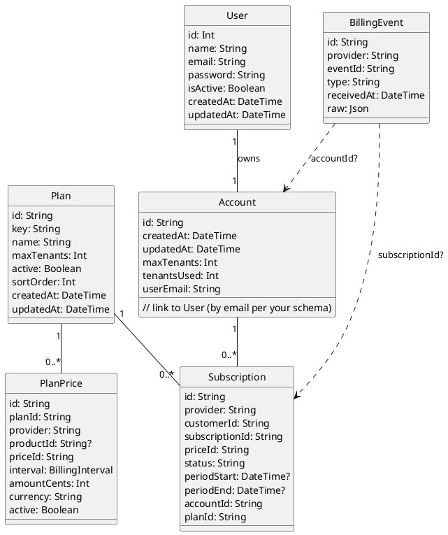

# Account Module

Account-level subscription and quota management for multi-tenant SaaS. This module owns billing/subscription state and enforces how many tenants an account can create.

## Goals

- Tie billing to an Account (one invoice) instead of per-tenant billing.
- Control tenant quota: `maxTenants` per account; creating a tenant consumes quota.
- Keep tenant seat-limits independent (still managed by the Tenants module).

## Terminology

- **Account**: Billing entity (owned by a user). Controls `maxTenants` and subscription status.
- **Tenant**: A workspace/organization that users operate in. Belongs to an Account.
- **Owner**: The user who owns the Account (Role.OWNER at account-level).

## Flows

- **Register**
  1. User signs up and logs in.
  2. Optionally verifies email.

- **Start Checkout (Account-level)**
  1. User chooses a plan (maps to `maxTenants`).
  2. Backend creates a checkout session with metadata `{ userId, planId }`.
  3. Return `checkoutUrl` to client.

- **Webhook: Payment Success**
  1. Verify signature.
  2. Resolve `userId` and `planId` from metadata/event.
  3. If no Account exists for user: create `Account { ownerUserId, maxTenants, tenantsUsed: 0, billing fields }`.
     - If Account exists: update billing fields and `maxTenants` per plan.
  4. Mark `status = active`.

- **Create Tenant under Account (quota)**
  1. User (account OWNER/ADMIN) requests to create a tenant.
  2. Service loads Account, checks `tenantsUsed < maxTenants`.
  3. Transaction:
     - Create `Tenant { accountId, ... }`.
     - Create `TenantMembership` for the creator (`OWNER` or `ADMIN`).
     - Increment `Account.tenantsUsed`.

- **Downgrade/Cancel**
  - On downgrade, update `maxTenants`. Do not delete existing tenants; only block creating new ones if `tenantsUsed >= maxTenants`.
  - On cancel, set `status` appropriately; decide whether to freeze creation or tenant access.

## Authorization & Enforcement

- **Account-level roles**: Minimal requirement is the Account OWNER. You can extend with account admins if needed.
- **Guards**:
  - Keep `TenantGuard` for tenant-scoped requests.
  - Add an `AccountGuard` (or policy checks in services) to verify the requester owns the Account for account-scoped operations.
- **Transactions**: Always enforce `tenantsUsed < maxTenants` inside a Prisma transaction when creating a tenant to avoid race conditions.

## API Surface (examples)

REST

- `POST /account/billing/checkout` → returns `checkoutUrl`
- `POST /account/billing/webhook` → handles provider webhooks (create/update Account, set `maxTenants`)
- `POST /account/:accountId/tenants` → create tenant under account (enforces quota)
- `GET /account/:accountId` → account details, quota state

GraphQL

```graphql
# Query current user's account and quota
query MyAccount {
  myAccount {
    id
    status
    maxTenants
    tenantsUsed
    tenants {
      id
      name
      slug
    }
  }
}

# Create a tenant under the account (requires account ownership)
mutation CreateTenant($accountId: String!, $input: CreateTenantInput!) {
  createTenantUnderAccount(accountId: $accountId, input: $input) {
    id
    name
    slug
  }
}
```

## Webhook Handling (Stripe example)

- Verify signature with Stripe SDK.
- On `checkout.session.completed` or `invoice.paid`:
  - Read metadata: `userId`, `planId`.
  - Upsert Account and set `maxTenants` via plan mapping.
  - Store `customerId`, `subscriptionId`, `priceId`, `status`.
- Idempotency: ensure each event is processed once (store `eventId`).

## Plan → Quota Mapping

Define a simple map in code, e.g.:

```ts
const PLAN_TO_QUOTA: Record<string, number> = {
  price_basic: 1,
  price_pro: 3,
  price_business: 10,
};
```

## Migration Checklist

- Add `Account` model and link `Tenant.accountId`.
- Backfill: create accounts for existing paying owners and assign their tenants.
- Add indexes on `Account.ownerUserId` and `Tenant.accountId`.

## UI/UX Notes

- If a user has no active Account subscription, show “Choose a plan” CTA.
- After payment success, show Account dashboard with quota status and a “Create tenant” button.
- If `tenantsUsed >= maxTenants`, show upgrade CTA.

## Related Modules

- `src/tenants/` — manages tenant data and seat limits per tenant.
- `src/auth/` — authentication; ensure user identity is available for account ownership checks.

## Roadmap

- Account admins and members (account-level RBAC).
- Subscription management (upgrade/downgrade/cancel) endpoints.
- Email notifications for quota thresholds.
- Analytics on tenant usage per account.

## Billing Adapter Pattern (provider-agnostic)

To keep the billing provider pluggable, use an adapter pattern with NestJS DI.

### Goals

- Swap providers (Stripe, Paddle, LemonSqueezy, Mock) without changing business logic.
- Centralize mapping from plan → quota (`maxTenants`).
- Uniform webhook handling shape.

### Folder Structure (suggested)

```
src/account/billing/
  billing.tokens.ts          # DI tokens
  billing.types.ts           # common interfaces & DTOs
  billing.service.ts         # thin orchestration over adapter
  adapters/
    stripe.adapter.ts        # Stripe implementation
    mock.adapter.ts          # Mock for dev/tests
```

### Interfaces (`billing.types.ts`)

```ts
export type ProviderEvent = {
  id: string;
  type: string; // e.g., checkout.session.completed
  raw: unknown; // original payload
};

export type CheckoutPayload = {
  userId: number;
  planId: string; // maps to quota
  successUrl: string;
  cancelUrl: string;
  metadata?: Record<string, string>;
};

export type CheckoutResult = {
  url: string; // redirect to hosted checkout
};

export type SubscriptionState = {
  customerId?: string;
  subscriptionId?: string;
  priceId?: string;
  status?:
    | 'active'
    | 'trialing'
    | 'past_due'
    | 'canceled'
    | 'incomplete'
    | string;
  planId?: string;
};

export interface IBillingAdapter {
  createCheckout(payload: CheckoutPayload): Promise<CheckoutResult>;
  verifyWebhook(
    signature: string | undefined,
    rawBody: Buffer,
  ): Promise<ProviderEvent>;
  parseSubscriptionState(evt: ProviderEvent): Promise<SubscriptionState | null>;
}

export interface IPlanQuotaResolver {
  planToMaxTenants(planId: string): number;
}
```

### DI Tokens (`billing.tokens.ts`)

```ts
export const BILLING_ADAPTER = Symbol('BILLING_ADAPTER');
export const PLAN_QUOTA_RESOLVER = Symbol('PLAN_QUOTA_RESOLVER');
```

### Billing Orchestration (`billing.service.ts`)

```ts
import { Inject, Injectable } from '@nestjs/common';
import { BILLING_ADAPTER, PLAN_QUOTA_RESOLVER } from './billing.tokens';
import {
  IBillingAdapter,
  IPlanQuotaResolver,
  CheckoutPayload,
} from './billing.types';

@Injectable()
export class BillingService {
  constructor(
    @Inject(BILLING_ADAPTER) private readonly adapter: IBillingAdapter,
    @Inject(PLAN_QUOTA_RESOLVER) private readonly quota: IPlanQuotaResolver,
  ) {}

  createCheckout(payload: CheckoutPayload) {
    return this.adapter.createCheckout(payload);
  }

  async handleWebhook(signature: string | undefined, rawBody: Buffer) {
    const evt = await this.adapter.verifyWebhook(signature, rawBody);
    const sub = await this.adapter.parseSubscriptionState(evt);
    if (!sub) return { handled: false };

    const maxTenants = sub.planId
      ? this.quota.planToMaxTenants(sub.planId)
      : undefined;
    return { handled: true, event: evt, subscription: sub, maxTenants };
  }
}
```

### Example Adapters

- Stripe (`adapters/stripe.adapter.ts`): uses Stripe SDK to implement `IBillingAdapter`.
- Mock (`adapters/mock.adapter.ts`): returns fake URLs and parses a simple JSON payload for local/dev/testing.

```ts
// adapters/mock.adapter.ts
import {
  IBillingAdapter,
  CheckoutPayload,
  CheckoutResult,
  ProviderEvent,
  SubscriptionState,
} from '../billing.types';

export class MockBillingAdapter implements IBillingAdapter {
  async createCheckout(_: CheckoutPayload): Promise<CheckoutResult> {
    return { url: 'http://localhost:3000/mock-checkout' };
  }
  async verifyWebhook(
    _: string | undefined,
    rawBody: Buffer,
  ): Promise<ProviderEvent> {
    const body = JSON.parse(rawBody.toString());
    return {
      id: body.id ?? 'evt_mock',
      type: body.type ?? 'invoice.paid',
      raw: body,
    };
  }
  async parseSubscriptionState(
    evt: ProviderEvent,
  ): Promise<SubscriptionState | null> {
    if (
      evt.type === 'invoice.paid' ||
      evt.type === 'checkout.session.completed'
    ) {
      const raw: any = evt.raw;
      return {
        customerId: raw.customerId ?? 'cus_mock',
        subscriptionId: raw.subscriptionId ?? 'sub_mock',
        priceId: raw.priceId ?? 'price_basic',
        status: 'active',
        planId: raw.planId ?? 'price_basic',
      };
    }
    return null;
  }
}
```

### Wiring in `AccountModule`

Use environment variable `BILLING_PROVIDER` to choose adapter.

```ts
import { Module } from '@nestjs/common';
import { BillingService } from './billing/billing.service';
import { BILLING_ADAPTER, PLAN_QUOTA_RESOLVER } from './billing/billing.tokens';
import { MockBillingAdapter } from './billing/adapters/mock.adapter';

class StaticPlanResolver {
  // simple default
  planToMaxTenants(planId: string) {
    return (
      ({ price_basic: 1, price_pro: 3, price_business: 10 } as any)[planId] ?? 1
    );
  }
}

@Module({
  providers: [
    BillingService,
    { provide: PLAN_QUOTA_RESOLVER, useClass: StaticPlanResolver },
    {
      provide: BILLING_ADAPTER,
      useFactory: () => {
        switch (process.env.BILLING_PROVIDER) {
          // case 'stripe': return new StripeBillingAdapter(process.env.STRIPE_SECRET!);
          default:
            return new MockBillingAdapter();
        }
      },
    },
  ],
  exports: [BillingService, PLAN_QUOTA_RESOLVER],
})
export class AccountModule {}
```

### Usage in Controllers/Resolvers

- `POST /account/billing/checkout`: call `billingService.createCheckout(...)` and return URL.
- `POST /account/billing/webhook`: pass raw body + signature to `billingService.handleWebhook(...)`, then upsert `Account` with returned `subscription` and `maxTenants`.

### Benefits

- Business logic remains stable while switching providers.
- Webhook and checkout code paths are consistent.
- Easy to add feature flags for trials, coupons, taxes per adapter.

```seqdiag
seqdiag {
  user        -> api         [label = "POST /account/billing/checkout (planId)"];
  api         -> billing     [label = "createCheckout(userId, planId)"];
  billing    --> api         [label = "CheckoutResult(url)"];
  api        --> user        [label = "200 { url }"];
}
```

```seqdiag
seqdiag {
  billing     -> api         [label = "POST /account/billing/webhook (signed)"];
  api         -> billing     [label = "verifyWebhook(signature, rawBody)"];
  billing    --> api         [label = "ProviderEvent"];
  api         -> billing     [label = "parseSubscriptionState(evt)"];
  billing    --> api         [label = "SubscriptionState { planId, status, ... }"];

  api         -> quota       [label = "planToMaxTenants(planId)"];
  quota      --> api         [label = "maxTenants"];

  api         -> db          [label = "Upsert Account + subscription + maxTenants"];
  db         --> api         [label = "OK"];

  api        --> billing     [label = "200"];
}
```

```seqdiag
seqdiag {
  user        -> api         [label = "POST /account/:id/tenants (name, slug)"];
  api         -> db          [label = "Load Account { tenantsUsed, maxTenants }"];
  db         --> api         [label = "Account"];

  api         -> db          [label = "TX: create Tenant, Membership, inc tenantsUsed"];
  db         --> api         [label = "TX committed"];

  api        --> user        [label = "201 { tenant }"];
}
```


