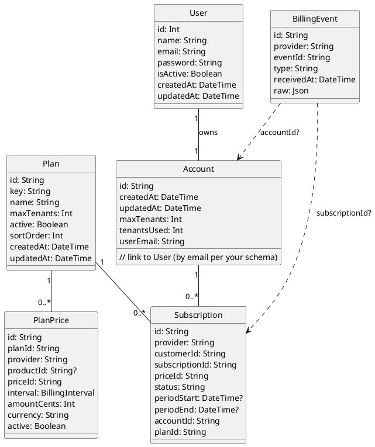

# Account Module

## Purpose

Account-level subscription and quota management for multi-tenant SaaS. This module owns billing/subscription related state and enforces how many tenants an account can create.

## Structure

### Core Modules

- `account.module.ts` – Main module definition

## Features

- Tie billing to an Account (one invoice) instead of per-tenant billing.
- Control tenant quota: `maxTenants` per account; creating a tenant consumes quota.
- Keep tenant seat-limits independent (still managed by the Tenants module).

## Terminology

- **Account**: Billing entity (owned by a user). Controls `maxTenants` and subscription status.
- **Tenant**: A workspace/organization that users operate in. Belongs to an Account.
- **Owner**: The user who owns the Account (Role.OWNER at account-level).

## Flows

- **Create Tenant under Account (quota)**
  1. User (account OWNER/ADMIN) requests to create a tenant.
  2. Service loads Account, checks `tenantsUsed < maxTenants`.
  3. Transaction:
     - Create `Tenant { accountId, ... }`.
     - Create `TenantMembership` for the creator (`OWNER` or `ADMIN`).
     - Increment `Account.tenantsUsed`.

- **Downgrade/Cancel**
  - On downgrade, update `maxTenants`. Do not delete existing tenants; only block creating new ones if `tenantsUsed >= maxTenants`.
  - On cancel, set `status` appropriately; decide whether to freeze creation or tenant access.

## Authorization & Enforcement

- **Account-level roles**: Minimal requirement is the Account OWNER. You can extend with account admins if needed.
- **Guards**:
  - Keep `TenantGuard` for tenant-scoped requests.
  - Add an `AccountGuard` (or policy checks in services) to verify the requester owns the Account for account-scoped operations.
- **Transactions**: Always enforce `tenantsUsed < maxTenants` inside a Prisma transaction when creating a tenant to avoid race conditions.

## Related Modules

- `src/tenants/` — manages tenant data and seat limits per tenant.
- `src/auth/` — authentication; ensure user identity is available for account ownership checks.

### Folder Structure

```
src/account/
  account.module.ts
  /register/
    register.service.ts
    register.module.ts
```


